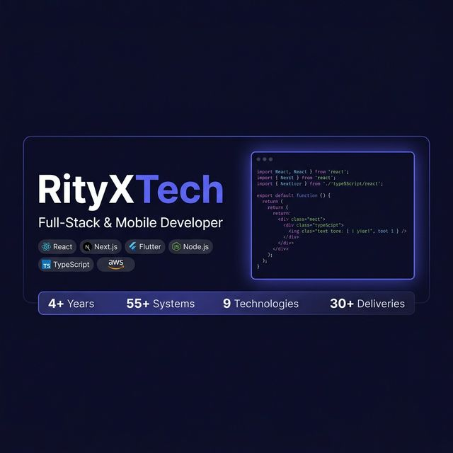

<div align="center">
  
</div>

<div align="center">

  
  
  
  
  
  
  
  

</div>

---

# RityXTech Portfolio

> **Precision Over Noise** — Architecting high-performance full-stack and mobile ecosystems.

A production-grade, interactive portfolio showcasing scalable systems, mobile ecosystems, and high-fidelity UI engineering. Built with React, TypeScript, Three.js, and deployed on Vercel.

## ✨ Features

- **3D Immersive Hero** — React Three Fiber `<Canvas>` with animated code monolith and binary particle rain
- **Smooth Scroll** — Lenis-powered smooth scrolling with custom scrollbar
- **Scramble Text & Typewriter** — Custom animated text reveal components
- **Particle Loader** — Cinematic intro sequence before page load
- **Secure Contact API** — Server-side contact form with Supabase integration
- **Admin Dashboard** — JWT-protected admin panel with server-validated authentication
- **Responsive Design** — Mobile-first with a custom bottom navigation bar
- **Pull-to-Refresh** — Native-feel mobile refresh gesture
- **Anti-Theft Image Protection** — Global drag/context-menu prevention on all images

## 🛠 Tech Stack

| Layer | Technologies |
|---|---|
| **Frontend** | React 18, TypeScript, Vite, Tailwind CSS v4, Framer Motion |
| **3D / Graphics** | Three.js, React Three Fiber, Drei |
| **Backend / API** | Node.js, Express (via Vercel Serverless Functions), PHP, WordPress |
| **Database** | Supabase (PostgreSQL) |
| **Auth** | JWT (jsonwebtoken) |
| **Mobile** | Flutter, React Native, Kotlin |
| **Cloud** | AWS (EC2, S3), Cloudflare (R2, Stream), Vercel, Docker |

## 🚀 Run Locally

**Prerequisites:** Node.js ≥ 18

```bash
# 1. Clone the repository
git clone https://github.com/Rityxtech/My-Portfolio.git
cd My-Portfolio

# 2. Install dependencies
npm install

# 3. Configure environment variables
cp .env.example .env
# Fill in your keys in .env (see .env.example for required variables)

# 4. Start the development server
npm run dev
```

The app will be available at `http://localhost:5173`.

## 🔐 Environment Variables

Copy `.env.example` to `.env` and populate the following:

```env
GEMINI_API_KEY=           # Google Gemini API key
SUPABASE_URL=             # Your Supabase project URL
SUPABASE_ANON_KEY=        # Supabase anonymous/public key
SUPABASE_SERVICE_ROLE_KEY=# Supabase service role key (server-side only)
JWT_SECRET=               # Strong random secret for JWT signing
ADMIN_PASSWORD=           # Hashed admin password
```

> ⚠️ **Never commit `.env` to version control.** It is already listed in `.gitignore`.

## 📦 Build & Deploy

```bash
# Production build
npm run build

# Preview production build locally
npm run preview
```

Deployment is handled automatically via **Vercel** on every push to `main`. Environment variables are configured directly in the Vercel dashboard.

## 📊 Stats

| Metric | Value |
|---|---|
| Years of Expertise | 4+ |
| Systems Architected | 55+ |
| Technologies Mastered | 9+ |
| Successful Deliveries | 30+ |

## 📄 License

© 2024 RityXTech. All rights reserved.
